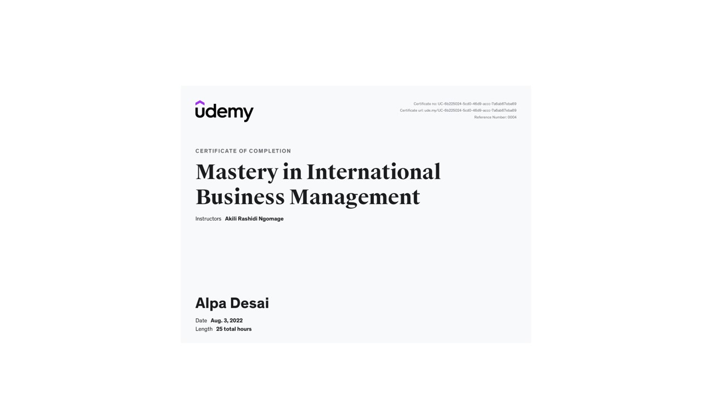

# Managing Global Enterprise

Project provides an overview of various fundamentals of international business

## 
## 

##
##
##
##
##
##
##
##
##

#### reference International business Varma, Sumati.

Additional details reference https://github.com/alpaddesai/BusinessDevelopmentMergersAcquisitionsIdea
